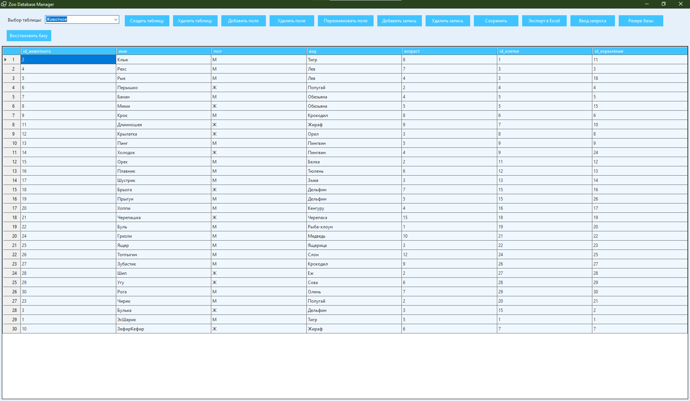

# Zoo Database Manager

**Zoo Database Manager** — это десктопное приложение на Windows Forms и .NET Framework для управления базой данных PostgreSQL. Проект демонстрирует реализацию многоуровневой архитектуры (UI, BLL, DAL) и предназначен для управления данными зоопарка.

  <!-- Замените на URL вашего скриншота -->

---

## 🚀 Основные возможности

- **Управление таблицами:** Создание, удаление таблиц.
- **Управление структурой:** Добавление, удаление и переименование столбцов.
- **Работа с данными (CRUD):** Добавление и удаление записей в таблицах, редактирование данных напрямую в сетке.
- **Выполнение SQL-запросов:** Встроенный редактор для выполнения произвольных SQL-запросов с возможностью сохранения и загрузки.
- **Импорт/Экспорт:** Экспорт таблиц и результатов запросов в формат Excel (`.xlsx`).
- **Резервное копирование:** Создание и восстановление резервных копий всей базы данных с использованием утилит `pg_dump` и `pg_restore`.

---

## 🛠️ Архитектура проекта

Проект построен на основе классической трехслойной архитектуры для разделения ответственности и улучшения тестируемости и поддержки:

- **Presentation Layer (UI):** Папка `UI/`. Содержит все формы Windows Forms. Этот слой отвечает исключительно за отображение данных и взаимодействие с пользователем.
- **Business Logic Layer (BLL):** Папка `Services/`. Содержит сервисы, которые инкапсулируют бизнес-логику приложения (например, валидация данных перед созданием таблицы).
- **Data Access Layer (DAL):** Папка `DataAccess/`. Содержит репозиторий, отвечающий за прямое взаимодействие с базой данных PostgreSQL.
- **Infrastructure:** Папка `Infrastructure/`. Вспомогательные классы для работы с конфигурацией, файловой системой и внешними процессами.
- **Models:** Папка `Models/`. Простые классы (POCO) для передачи данных между слоями.

---

## ⚙️ Установка и запуск

### Предварительные требования

1.  **.NET Framework 4.7.2** или новее.
2.  **PostgreSQL Server** (версия 12 и выше рекомендуется).
3.  Созданная база данных с именем `Zoo`.

### Пошаговая инструкция

1.  **Клонируйте репозиторий:**
    ```bash
    git clone https://github.com/your-username/zoo-db-manager.git
    cd zoo-db-manager
    ```

2.  **Настройте конфигурацию:**
    - Откройте проект в Visual Studio.
    - В корне проекта найдите файл `App.config`. Его содержимое указывает на секретный файл конфигурации.
    - Создайте в корне проекта новый файл с именем `App.secrets.config`.
    - Скопируйте в него следующее содержимое и **заполните своими данными**:

    ```xml
    <?xml version="1.0" encoding="utf-8" ?>
    <appSettings>
      <!-- Шаблон строки подключения. {0} будет заменен паролем. -->
      <add key="ConnectionStringTemplate" value="Host=localhost;Port=5432;Database=Zoo;Username=postgres;Password={0}" />
      <!-- ВАШ ПАРОЛЬ от базы данных -->
      <add key="DbPassword" value="ВАШ_ПАРОЛЬ_ЗДЕСЬ" />
      
      <!-- Абсолютные пути к утилитам PostgreSQL -->
      <add key="PgDumpPath" value="C:\Program Files\PostgreSQL\14\bin\pg_dump.exe" />
      <add key="PgRestorePath" value="C:\Program Files\PostgreSQL\14\bin\pg_restore.exe" />
      
      <!-- Путь к файлу для сохранения пользовательских SQL-запросов -->
      <add key="SavedQueriesFilePath" value="queries.txt"/>
    </appSettings>
    ```
    > **Важно:** Убедитесь, что пути к `pg_dump.exe` и `pg_restore.exe` соответствуют вашей установке PostgreSQL. В свойствах файла `App.secrets.config` в Visual Studio установите **"Copy to Output Directory"** в **"Copy if newer"**.

3.  **Соберите и запустите проект:**
    - Откройте решение в Visual Studio.
    - Восстановите NuGet-пакеты (если требуется).
    - Нажмите `F5` для запуска приложения.

---

## 📦 Зависимости

- [Npgsql](https://www.npgsql.org/) - .NET провайдер для PostgreSQL.
- [ClosedXML](https://github.com/ClosedXML/ClosedXML) - Библиотека для работы с файлами Excel без установленного MS Office.